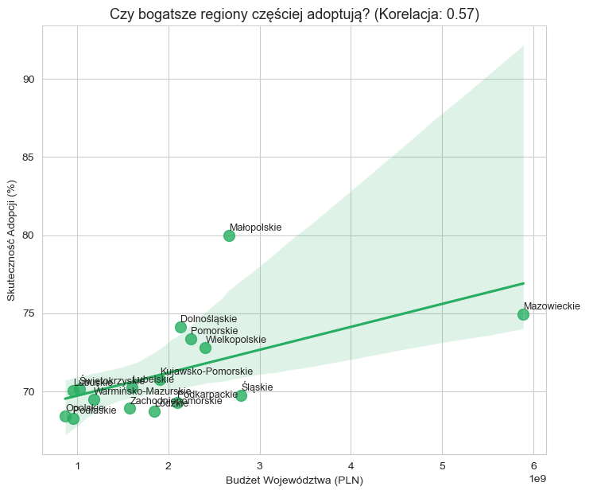
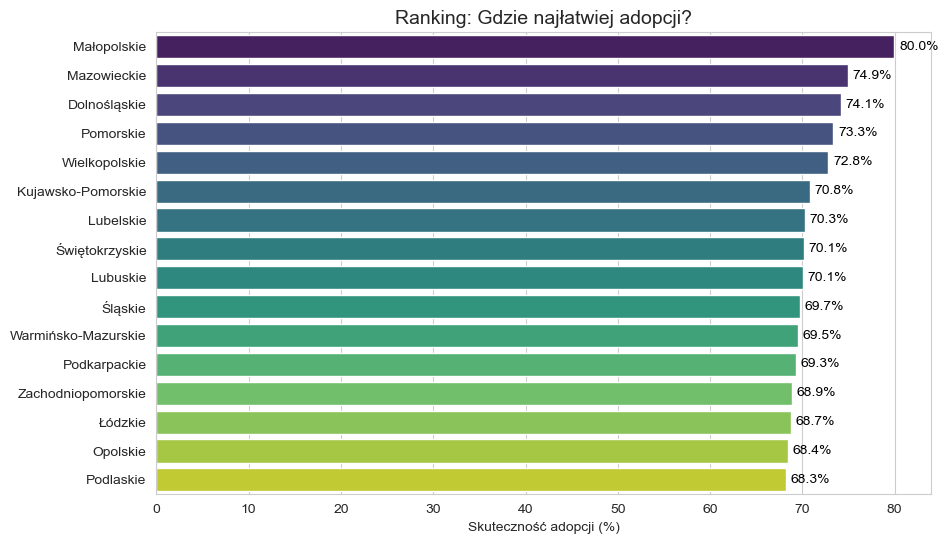
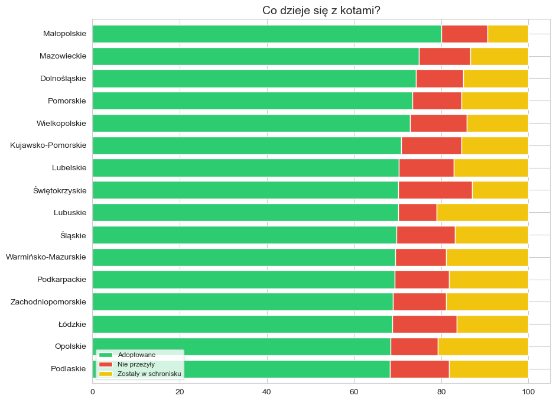
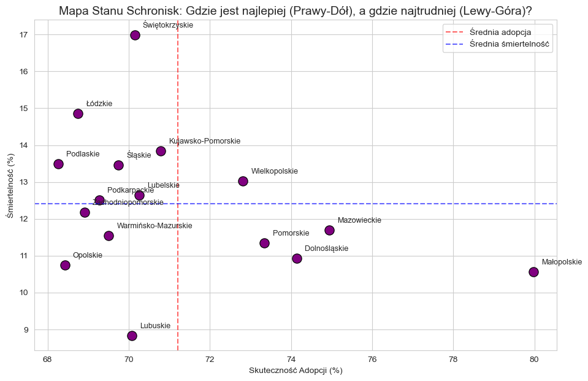

# 🐈 Cat Adoption vs. Regional Wealth: An EDA Study (Poland)

## 📖 Project Overview
Does economic prosperity directly translate to better animal welfare? This project explores the relationship between the **budgetary wealth of Polish voivodeships** and the **effectiveness of cat adoptions** in local shelters. 

The goal was to verify if wealthier regions exhibit higher adoption rates or if social factors play a more significant role in animal rescue.

## 🛠️ Tech Stack
- **Language:** Python
- **Libraries:** Pandas (Data manipulation), Seaborn & Matplotlib (Visualization), Scipy (Statistical correlation)
- **Analysis Type:** Exploratory Data Analysis (EDA)

## 📈 Key Insights & Visualizations

### 1. The Wealth-Adoption Correlation

**Insight:** Contrary to the initial hypothesis, the analysis shows that **regional wealth is not a primary driver for adoption rates**. The correlation coefficient suggests that community engagement and local shelter proactivity are more influential than the absolute budget of a region.

### 2. Adoption Efficiency by Region

**Insight:** There is a significant disparity in adoption success across Poland. This ranking identifies "Model Regions" where shelters achieve over 80-90% adoption efficiency, providing a benchmark for underperforming areas.

### 3. Shelter Outcome Distribution

**Insight:** By analyzing adoptions, mortality, and long-term stays simultaneously, we can see the full picture of the animal welfare crisis. High mortality in certain regions highlights where veterinary support and funding are most urgently needed.

### 4. Strategic Performance Quadrants

**Insight:** This quadrant analysis maps regions based on **Adoption Rate vs. Mortality Rate**. It clearly distinguishes regions with high-performing welfare systems from those facing systemic challenges.

## 📊 Summary of Findings
- **Social Over Economic:** Cultural and social factors appear to outweigh GDP in determining adoption success.
- **Geographic Variance:** Significant differences between voivodeships suggest that local animal welfare policies vary greatly in effectiveness.

## 📁 Repository Structure
- `data/`: Raw and processed datasets containing shelter and economic statistics.
- `images/`: Exported visualizations used for this report.
- `notebooks/`: Jupyter Notebook with the complete EDA process.
